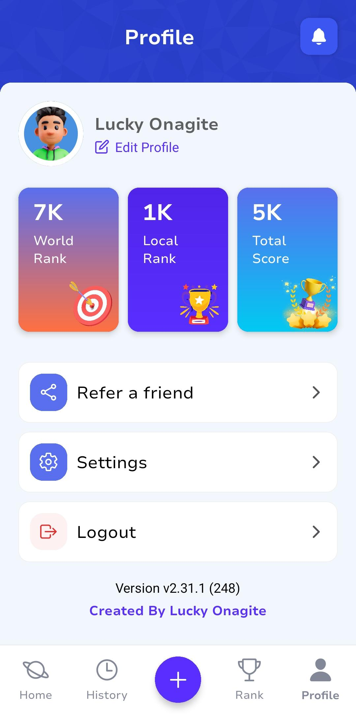

# PlutoQuiz 🚀

PlutoQuiz is a quiz app Template built with React Native and Expo.

It allows users to take quizzes on various topics such as science, Geography, Sports, Biology. Users can create Quizzes, Join and navigate through questions, select answers, see their scores, and get a detailed breakdown of their performance.


## Download
- Build v1.0.0: [APK](https://github.com/Whebcraft/PlutoQuiz/PlutoQuiz-v1.0.0.apk)

---

### Screenshots

<table>
  <tr>
    <td>
    
    </td>
    <td>
    
    </td>
    <td>
    
    </td>
  </tr>
</table>


---


### Setup

Follow these steps to set up the PlutoQuiz app on your local machine:
Prerequisites

    Node.js
    Expo CLI

### Installation

Clone the repository:

```bash
git clone https://github.com/Whebcraft/PlutoQuiz.git
```

Install dependencies:

```bash
npm install
```

Enter your expo projectId in `app.json`

```js
  "extra": {
    "eas": {
       "projectId": "0e0f88c1-30ea-4dfa-adf9-65a274bd705e"
    }
  }
```

Start the Expo server:

```bash
expo start
```

Run the app:

On an Android device or emulator: Press a 

On an iOS device or simulator: Press i

Build App - iOS

```bash
eas build -p ios
```

Build App - Android

```bash
eas build -p android
```
